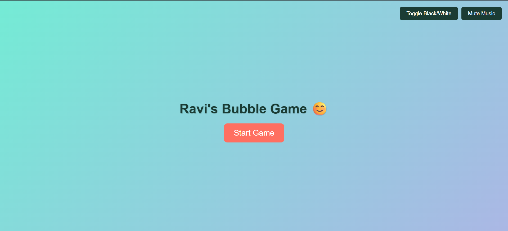
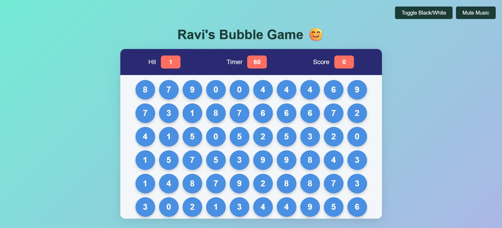

# 🎈 Ravi's Bubble Game 😊

Ravi's Bubble Game is a fun and interactive browser-based game where players must quickly click on the matching bubble number before the timer runs out. It's built using **HTML**, **CSS**, and **JavaScript**, and includes cool features like background toggling and background music.

## Live preview

[https://raviranjanmishra01.github.io/bubble-game/](https://raviranjanmishra01.github.io/bubble-game/)


## preview
First page

 

Second Page



## 🚀 Features

- ⏱️ 60-second countdown timer.
- 🎯 Click the correct bubble number to earn points.
- 🔢 Randomly generated bubble numbers.
- 🎵 Background music with mute/play toggle.
- 🎨 Toggle between white and black backgrounds.
- 📱 Fully responsive for mobile and desktop screens.
- 🧠 Simple logic, addictive gameplay!

## 🎮 How to Play

1. Click the **Start Game** button.
2. A target number ("Hit") will appear at the top.
3. Click on the bubble that matches the "Hit" number.
4. You earn **10 points** for each correct match.
5. Game ends when the timer reaches **0**.
6. Try to score as high as possible before time runs out!

## 🛠️ Technologies Used

- **HTML5** – Game structure and layout.
- **CSS3** – Styling and responsive design.
- **JavaScript (Vanilla)** – Game logic, DOM interaction, event handling.
- **Audio** – Background music integration.

## 📁 Project Structure
```js
project-folder/
│
├── index.html # Main HTML file
├── style.css # CSS styling
├── js.js # JavaScript game logic
└── README.md # This file
```

## 🧩 To Do (Optional Features)

- High score saving using localStorage.
- Difficulty levels (easy, medium, hard).
- Pause/Resume functionality.
- Bubble animations or explosion effects.

## 💡 Inspiration

This game is inspired by classic bubble-popping games and is a great way to learn basic DOM manipulation, event handling, and game logic in JavaScript.

## 👨‍💻 Author

**Ravi** 

---

Feel free to fork, modify, or contribute to this project!
